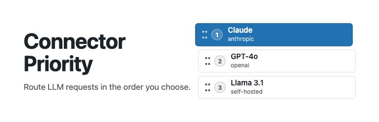

# Connector Priority



[](https://playground.wordpress.net/?blueprint-url=https://raw.githubusercontent.com/georgestephanis/connector-priority/trunk/.github/blueprint.json)

A WordPress plugin that adds drag-and-drop priority ordering for AI connectors on the **Settings > Connectors** screen introduced in WordPress 7.0.

## What it does

When multiple AI provider connectors are active (e.g. OpenAI, Anthropic, and Google are all connected), WordPress currently has no way to express which one should be preferred. This plugin adds:

- A **"Set AI Priority Order"** button on the Connectors screen that opens a dedicated priority editor inside the same admin SPA.
- A **drag-and-drop list** of all registered AI providers — drag to reorder, then click **Save Priority Order**.
- The saved order is stored in the `wp_connector_priority_order` site option and exposed via the `/wp/v2/settings` REST endpoint.
- Two public PHP functions for use by other plugins and themes:
  - `wp_get_connector_priority_order()` — returns the full ordered list of connector IDs.
  - `wp_get_preferred_ai_connector()` — returns the ID of the highest-priority AI connector that is currently active.

## Requirements

- WordPress 7.0 or later (requires the Connectors API and Boot module SPA).
- At least one AI provider plugin installed (Anthropic, Google, OpenAI, or a third-party provider).

## Installation

1. Upload the `connector-priority` folder to `wp-content/plugins/`.
2. Activate the plugin from **Plugins > Installed Plugins**.
3. Visit **Settings > Connectors** — a "Set AI Priority Order" button will appear at the top of the connector list.

## Usage

1. Click **Set AI Priority Order** on the Connectors screen.
2. Drag providers up or down to set your preferred order.
3. Click **Save Priority Order**.

The saved order is immediately available via `wp_get_connector_priority_order()`.

**Runtime enforcement (what works today):** All WordPress `ai` plugin features —
excerpt generation, content suggestions, alt-text, etc. — respect the saved order
immediately. The plugin hooks `wpai_preferred_text_models`, `wpai_preferred_image_models`,
and `wpai_preferred_vision_models` to re-sort the candidate model list by connector
priority before the AI client picks a provider.

**What still needs a core change:** Code that calls `wp_ai_client_prompt()` directly
(outside the `ai` plugin) bypasses these filters. Full enforcement for all callers
requires upstream changes to `PromptBuilder`; see [CORE-CHANGES.md](CORE-CHANGES.md)
for proposed patches.

## Developer API

```php
// Returns all connector IDs in priority order (padded with any unordered ones at the end).
$order = wp_get_connector_priority_order();
// → ['openai', 'anthropic', 'google', 'akismet']

// Returns the ID of the highest-priority active AI connector, or null.
$provider = wp_get_preferred_ai_connector();
// → 'openai'
```

## Architecture notes

Source JavaScript and CSS live in `src/`; built assets are committed to `build/` and served by WordPress. `npm run build` (webpack via `@wordpress/scripts`) bundles both JS entries as native ES modules so WordPress's Script Module system can load them with `type="module"`. dnd-kit is bundled into the content file; React/ReactDOM are externalised to the WP page globals.

The drag-and-drop UI (`src/priority-content.js`) is a native ES module registered as a WordPress Script Module and mounted at the `/priority` route inside the existing connectors SPA. Navigation uses the Boot module's `?p=` path-parameter convention.

See [CORE-CHANGES.md](CORE-CHANGES.md) for a full description of the upstream WordPress core changes that would give this plugin complete end-to-end priority enforcement.

## Development

```bash
npm install          # install tooling
npm run build        # compile src/ → build/
npm run lint:js      # ESLint
npm run lint:css     # Stylelint
npm run lint:php     # PHPCS (requires composer install)
npm run format       # Prettier (JS + CSS)
npm run build-plugin # package a distributable zip
```

## License

GPL-2.0-or-later — see <https://www.gnu.org/licenses/gpl-2.0.html>.
